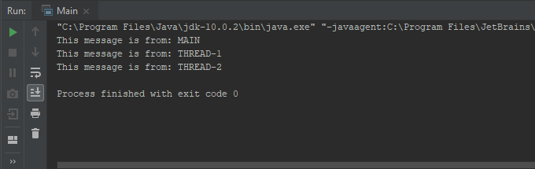
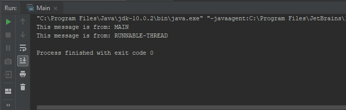
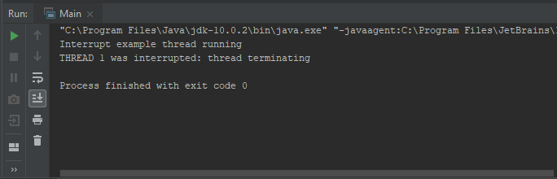
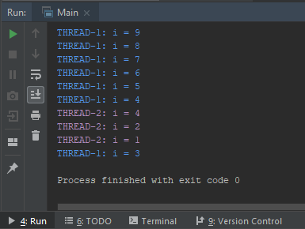
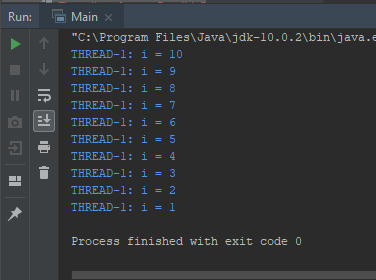
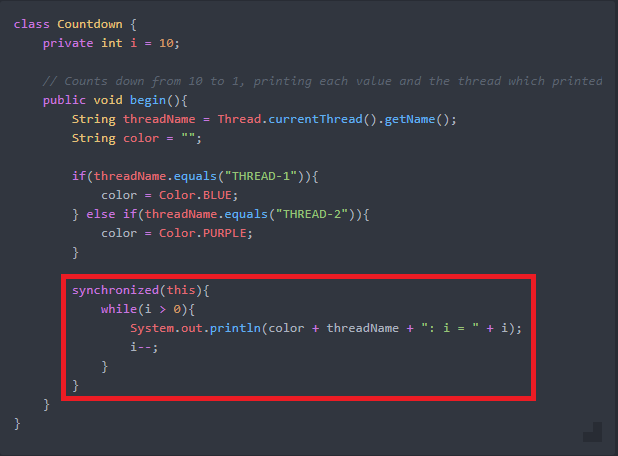

# Concurrency in Java: Overview
### Aim:
This repository is intend to outline the key concepts of concurrency in Java and provide reference materials that may act as a refresher on the topic of concurrency/threads in Java.
### Introduction
Concurrency in programming is the ability of a computer to execute 2 or more tasks at the same time. More accurately, the tasks are executed one at a time but done in such a way as to give the appearance of being executed in parallel (at the same time).

For example, consider an application designed to do the following:
- Download data
- Draw a shape on the monitor using the data

Without concurrency, this application would first download all the data then draw the shape once all the required data had finished downloading.

A concurrent implementation of this application however could download some data, draw a pixel on the screen, download some more data then draw another pixel etc and by repeating this process it appears to the user that the program is executing both tasks at the same time.

Concurrency allows:
- Multiple apps to run at the same time on a smartphone
- Website servers to process the requests of simultaneous users
- Multiple applications to run at the same time on a computer
- GUI based programs to perform background tasks that do not interrupt user experience

##### Concurrency Terms Defined
- **Process:** A process is a unit of execution that has its own memory space, called a ***heap***, which cannot be accessed by any other process. A heap can only be accessed by the unique process associated with it. When a Java console application is run, a process is kicked off. When we start a GUI application on a computer, a process is kicked off. A process is made up of threads and all processes always have at minimum of one thread, in Java called the "main" thread.

- **Thread:** A thread is a unit of execution within a process that, similarly to a process, has its own memory space called a ***thread stack***. All threads created by a process have access to that processes' heap (memory and files). A single process can have multiple threads.

### Using Threads in Java
Java provides the *java.lang.Thread* class or *java.lang.Runnable* interface for working with threads.
```Java
import java.lang.Thread;
import java.lang.Runnable;
```
#### Creating Threads
There are 2 approaches of creating new threads in Java, outlined below:
1. ) A new thread may be created by creating a class that inherits from the *Thread* class and overriding the *run()* method. The code to be executed in a new thread is placed inside the *run()* method.

```java
import java.lang.Thread;

public class Thread1 extends Thread {
    private final static String threadName = "THREAD-1";

    @Override
    public void run(){
        this.setName(threadName);
        System.out.println("This message is from: " + this.getName());
    }
}
```
2. ) New threads may also be created by creating a class that implements the *Runnable* interface provided by *java.lang.Runnable* and implementing the *run()* method of the interface, placing the code to be executed by the new thread inside the *run()* method.

```Java
import java.lang.Runnable;

public class RunnableThread implements Runnable {
    private static final String threadName = "RUNNABLE-THREAD";

    @Override
    public void run(){
        System.out.println("This message is from: " + threadName);
    }
}
```
#### Running Threads
- To run a thread created through approach *1)*, we instantiate a *Thread* object, here *thread1* and *thread2*, then call the Thread objects' *start()* methods from the *'main'* thread:

```Java
import java.lang.Thread;

public class Main {

    public static void main(String[] args) {
    	System.out.println("This message is from: " + Thread.currentThread().getName().toUpperCase());
	    Thread thread1 = new Thread1();
	    Thread thread2 = new Thread2();
	    thread1.start();
	    thread2.start();
    }
}
```
*Note: 'Thread2' class available in source code*.
##### Output:

- To run a thread created through approach *2)*, a *Thread* object is instantiated along with an instance of our implemented *Runnable* class, which is passed as an argument to the constructor of the *Thread* object. The thread is ran by calling the *start()* method of the *Thread* object.

```Java
import java.lang.Thread;

public class Main {

    public static void main(String[] args) {
    	System.out.println("This message is from: " + Thread.currentThread().getName().toUpperCase());

    	Thread runnableThread = new Thread(new RunnableThread());
	    runnableThread.start();
    }
}
```
##### Output:


## Thread Methods

#### sleep(int milliseconds)
The sleep method temporarily suspends the thread for the specified length of time, either milliseconds or milliseconds plus nanoseconds. This method is OS and JVM dependent as some operating systems may not support the fine-tuning of thread sleep time to the desired level of granularity.

**Usage:** Sleep is used to free computing resources when we know for certain that a thread execution will not be needed for a set amount of time.

```java
/** Thread prints first statement and sleeps for 2 seconds
before printing the second.*/
public void run(){
      System.out.println("Thread beginning sleep");

      try {
          sleep(2000);
      }catch(InterruptedException e){
          System.out.println("Error: sleeping thread was interrupted");
          return;
      }

      System.out.println("2 seconds elapsed: thread running again");
}
```  

#### join()
Given two threads, *Thread A* and *Thread B*, joining *Thread B* to *A* will result in *Thread B* only being executed when *Thread A* has finished executing.

**Usage:** Joining is used when the execution of one thread relies on the output (execution) of another thread. For example, a *Thread A* may be responsible for downloading data and *Thread B* may handle reading that data and performing calculations. Joining *Thread B* to *A* ensures that *B* always has the data it needs to perform its function.   

```Java
/** The run method of Thread B */
public void run(){
    System.out.println("Thread B: I am initially running");

    try {
      threadA.join(); // joins Thread B to Thread A
      System.out.println("Thread A finished executing: Thread B has resumed");
    }catch(InterruptedException e){
      System.out.println("Error: joining Thread B to A");
      return;
    }

    System.out.println("Thread B now terminating");
}
```

#### interrupt()

The interrupt method is used to stop the execution of a thread so that it may perform another task. There are two ways for a thread register an interruption:
1. The thread catches an *InterruptedException* thrown in the *run()* method.
2. If *run()* calls no method that could throw an *InterruptedException*, the thread will periodically call the *Interrupted()* method which returns true if another thread has interrupted the thread, or false otherwise.

**Usage:** *interrupt()* is commonly used to terminate a thread's execution when the thread is no longer required.

```java
import java.lang.Thread;

public class Main {

    public static void main(String[] args) {
        // In this example, 'thread1' is interrupted by the main thread.
  	    Thread thread1 = new Thread1(){
          @Override
          public void run(){
              try {
                System.out.println("Interrupt example thread running");
                sleep(2000);
              }catch(InterruptedException e){
                System.out.println("THREAD 1 was interrupted: thread terminating");
                return;
              }
          }
        };
        thread1.start();
        thread1.interrupt();
    }
}
```
##### Output:



### Synchronization
Synchronization is a means of controlling when threads execute and therefore access their associated heap.

**Usage:** It allows developers to prevent *thread interference*, also known as *race conditions*.

In Java, synchronization may be applied to the following:
- Methods
- Statements

When a method is synchronized, it can only be executed by a single thread at any given time. All other threads which call on the synchronized method suspend until the thread currently executing the method has finished its call to the method.

Furthermore, if a class has multiple synchronized methods, only one of these methods is executed at any given time. *Synchronized methods from the same class are never executed simultaneously*.

Below is an example of application with no synchronization which results in thread interference:

```java
import java.lang.Thread;

public class Main {

    public static void main(String[] args) {
  		Countdown countdown = new Countdown();

  		Thread thread1 = new Thread1(){
  			@Override
  			public void run(){
  				countdown.begin();
  			}
  		};
  		Thread thread2 = new Thread2(){
  			@Override
  			public void run(){
  				countdown.begin();
  			}
  		};

  		thread1.start();
  		thread2.start();
    }
}

class Countdown {
	private int i = 10;

	public void begin(){
		String threadName = Thread.currentThread().getName();
		String color = "";

		if(threadName.equals("THREAD-1")){
			color = Color.BLUE;
		} else if(threadName.equals("THREAD-2")){
			color = Color.PURPLE;
		}
		while(i > 0){
			System.out.println(color + threadName + ": i = " + i);
			i--;
		}
	}
}

```

##### Output:


*Example of thread interference*

To synchronize a Java method, the **synchronized** key word is declared in the method signature, in this case we are synchronizing the *begin()* method of *Countdown* object:

```Java
// Counts down from 10 to 1, printing each value and the thread which printed it
public synchronized void begin(){
	String threadName = Thread.currentThread().getName();
	String color = "";

	if(threadName.equals("THREAD-1")){
		color = Color.BLUE;
	} else if(threadName.equals("THREAD-2")){
		color = Color.PURPLE;
	}

	while(i > 0){
		System.out.println(color + threadName + ": i = " + i);
		i--;
	}
}
```

##### Output:


*Thread interference has been eliminated*

Java allows also **code blocks** to be synchronized, as opposed to synchronizing an entire method.

Every Java object is associated with an *intrinsic lock*, also commonly known as a *monitor lock*, which can be used to achieve synchronization. This approach works as follows:
- Synchronization of a block of statements that work on an object is achieved by forcing threads to acquire the object's lock. A thread will only execute a synchronized code block associated with an object when that thread has acquired the object's lock.
- *Only one thread may hold an object's lock at any given time.* All other threads which wish to acquire the objects lock are suspend until the running thread releases it.



*Synchronization of code block for 'Countdown' class*

#### Synchronization Methods: wait() & notify()

These two methods may only be called from within synchronized code. They allow threads to communicate with each other. Their functions are as follows:

*Wait()* - suspends the current thread, until another thread calls *notify()* on the same object.

*notify()* - called by another thread to wake a thread that has been suspended with *wait()*.

The usage of the *wait()* and *notify()* methods are best illustrated by a **Producer-Consumer** example:

Consider a simple application which writes to and reads messages from a buffer:
